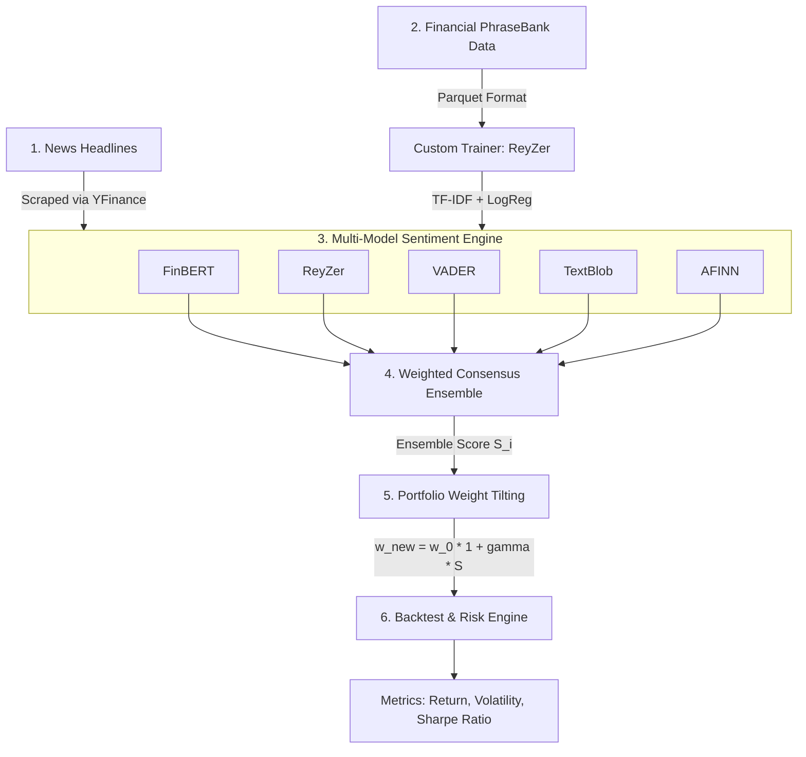

# 📈 Sentiment-Driven Portfolio Optimization & Management

An end-to-end Quantitative Finance and Natural Language Processing (NLP) framework that integrates classical Machine Learning, Transformer architectures, and Lexicon-based sentiment models to dynamically tilt portfolio asset weights and backtest risk-adjusted returns against market baselines.

---

## 🛠️ System Architecture Blueprint

## 💡 Key Features

* **Custom Statistical Model ("ReyZer"):** Built using TF-IDF n-gram vectorization and Logistic Regression trained directly on the *Financial PhraseBank* dataset.
* **Transformer Sentiment Engine:** Leverages `FinBERT` (`ProsusAI/finbert`) for context-aware financial sentiment analysis.
* **Lexicon Suite:** Integrates `VADER`, `TextBlob`, and `AFINN` for multi-perspective text processing.
* **Consensus Ensemble Strategy:** Blends outputs from deep learning, classical ML, and lexicons into a unified sentiment signal.
* **Quantitative Asset Allocation:** Dynamically adjusts baseline portfolio weights via sentiment factor tilting.
* **Backtesting & Portfolio Analytics:** Evaluates Annualized Returns, Volatility (Risk), and Sharpe Ratios.

---

## 🧠 Mathematical Foundations

### 1. TF-IDF & Custom Classifier ("ReyZer")
Words are transformed into continuous vector spaces using **Term Frequency - Inverse Document Frequency**:

$$\text{TF-IDF}(t, d) = \text{TF}(t, d) \times \log\left(\frac{N}{\text{DF}(t)}\right)$$

Where $t$ represents unigrams/bigrams, $d$ is a headline, and $N$ is total documents.

The predicted class probabilities $P(y=k \mid \mathbf{x})$ are output via the **Softmax function**:

$$P(y=k \mid \mathbf{x}) = \frac{e^{\mathbf{w}_k^T \mathbf{x} + b_k}}{\sum_{j=0}^{2} e^{\mathbf{w}_j^T \mathbf{x} + b_j}}$$

The continuous score $S_i \in [-1.0, +1.0]$ is derived as:

$$S_i = P(\text{Positive}) - P(\text{Negative})$$

---

### 2. Weighted Ensemble Formula
To reduce single-model variance, scores are combined using a weighted consensus formula:

$$S_{\text{Ensemble}} = 0.35 \cdot S_{\text{FinBERT}} + 0.35 \cdot S_{\text{ReyZer}} + 0.15 \cdot S_{\text{VADER}} + 0.15 \cdot S_{\text{TextBlob}}$$

---

### 3. Sentiment Portfolio Tilting
Given an equal-weighted baseline portfolio $w_0 = \frac{1}{N}$, each asset weight $w_i$ is tilted by sentiment score $S_i$ using sensitivity factor $\gamma = 0.5$:

$$w_i^{\text{raw}} = w_i^0 \cdot (1 + \gamma \cdot S_i)$$

To enforce a **long-only portfolio** constraint and ensure weights sum to $100\%$:

$$w_i^{\text{clipped}} = \max(w_i^{\text{raw}}, 0)$$

$$w_i^{\text{final}} = \frac{w_i^{\text{clipped}}}{\sum_{j=1}^{N} w_j^{\text{clipped}}}$$

---

### 4. Portfolio Performance & Risk Metrics
* **Annualized Expected Return:**
  $$E[R_p] = \mathbf{w}^T \mathbf{\mu} \cdot 252$$
* **Annualized Volatility (Risk):**
  $$\sigma_p = \sqrt{\mathbf{w}^T \mathbf{\Sigma} \mathbf{w} \cdot 252}$$
* **Sharpe Ratio:**
  $$\text{Sharpe} = \frac{E[R_p]}{\sigma_p}$$

---
