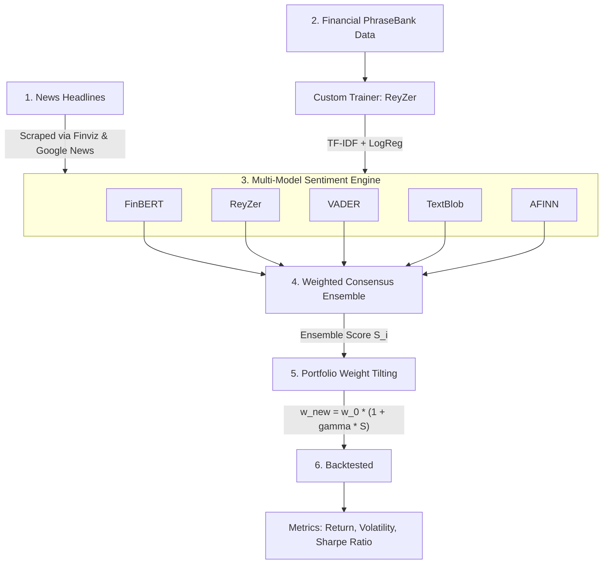

# 📈 Sentiment-Driven Portfolio Optimization & Management

## 🎯 Overview

Stock prices react fast to news, but traditional portfolio models only look at past prices. 
This project builds an automated **Quantitative Sentiment Pipeline** that analyzes real-time financial headlines using five distinct NLP models, combines their predictions into a single **Ensemble Score**, and automatically rebalances portfolio stock weights to improve risk-adjusted returns.

### ⚡ What It Does
* **Scrapes Real-Time News:** Fetches corporate news headlines and daily market pricing using `yfinance`.
* **Multi-Model Scoring:** Evaluates headlines using **FinBERT**, **ReyZer** (a custom TF-IDF + Logistic Regression model trained on Financial PhraseBank), **VADER**, **TextBlob**, and **AFINN**.
* **Consensus Ensemble Engine:** Combines Transformer, classical ML, and lexicon scores into one balanced sentiment signal:
  $$\text{Ensemble Score} = 0.35(\text{FinBERT}) + 0.35(\text{ReyZer}) + 0.15(\text{VADER}) + 0.15(\text{TextBlob})$$
* **Dynamic Portfolio Tilting:** Shifts baseline portfolio weights ($1/N$) toward high-sentiment stocks while keeping total allocation at $100\%$.
* **Backtesting & Analytics:** Calculates Annualized Return, Risk (Volatility), and Sharpe Ratio against the equal-weighted baseline portfolio.
---

## 🛠️ System Architecture Blueprint

## 💡 Key Features

* **Custom Statistical Model ("ReyZer"):** Built using TF-IDF n-gram vectorization and Logistic Regression trained directly on the *Financial PhraseBank* dataset.
* **Transformer Sentiment Engine:** Leverages `FinBERT` (`ProsusAI/finbert`) for context-aware financial sentiment analysis.
* **Lexicon Suite:** Integrates `VADER`, `TextBlob`, and `AFINN` for multi-perspective text processing.
* **Consensus Ensemble Strategy:** Blends outputs from deep learning, classical ML, and lexicons into a unified sentiment signal.
* **Quantitative Asset Allocation:** Dynamically adjusts baseline portfolio weights via sentiment factor tilting.
* **Backtesting & Portfolio Analytics:** Evaluates Annualized Returns, Volatility (Risk), and Sharpe Ratios.

---

## 🧠 Mathematical Foundations

### 1. TF-IDF & Custom Classifier ("ReyZer")
Words are transformed into continuous vector spaces using **Term Frequency - Inverse Document Frequency**:

$$\text{TF-IDF}(t, d) = \text{TF}(t, d) \times \log\left(\frac{N}{\text{DF}(t)}\right)$$

Where $t$ represents unigrams/bigrams, $d$ is a headline, and $N$ is total documents.

The predicted class probabilities $P(y=k \mid \mathbf{x})$ are output via the **Softmax function**:

$$P(y=k \mid \mathbf{x}) = \frac{e^{\mathbf{w}_k^T \mathbf{x} + b_k}}{\sum_{j=0}^{2} e^{\mathbf{w}_j^T \mathbf{x} + b_j}}$$

The continuous score $S_i \in [-1.0, +1.0]$ is derived as:

$$S_i = P(\text{Positive}) - P(\text{Negative})$$

---

### 2. Weighted Ensemble Formula
To reduce single-model variance, scores are combined using a weighted consensus formula:

$$S_{\text{Ensemble}} = 0.35 \cdot S_{\text{FinBERT}} + 0.35 \cdot S_{\text{ReyZer}} + 0.15 \cdot S_{\text{VADER}} + 0.15 \cdot S_{\text{TextBlob}}$$

---

### 3. Sentiment Portfolio Tilting
Given an equal-weighted baseline portfolio $w_0 = \frac{1}{N}$, each asset weight $w_i$ is tilted by sentiment score $S_i$ using sensitivity factor $\gamma = 0.5$:

$$w_i^{\text{raw}} = w_i^0 \cdot (1 + \gamma \cdot S_i)$$

To enforce a **long-only portfolio** constraint and ensure weights sum to $100\%$:

$$w_i^{\text{clipped}} = \max(w_i^{\text{raw}}, 0)$$

$$w_i^{\text{final}} = \frac{w_i^{\text{clipped}}}{\sum_{j=1}^{N} w_j^{\text{clipped}}}$$

---

### 4. Portfolio Performance & Risk Metrics
* **Annualized Expected Return:**
  $$E[R_p] = \mathbf{w}^T \mathbf{\mu} \cdot 252$$
* **Annualized Volatility (Risk):**
  $$\sigma_p = \sqrt{\mathbf{w}^T \mathbf{\Sigma} \mathbf{w} \cdot 252}$$
* **Sharpe Ratio:**
  $$\text{Sharpe} = \frac{E[R_p]}{\sigma_p}$$

---
## 📊 Dataset & Model Training

The custom **ReyZer** sentiment model is trained on the benchmark **Financial PhraseBank** dataset (`gtfintechlab/financial_phrasebank_sentences_allagree`).

* **Total Samples:** 2,264 human-annotated financial headlines with 100% agreement.
* **Train/Test Split:** 80% Training, 20% Testing (Stratified by class label).
* **Feature Extraction:** `TfidfVectorizer` (Unigrams & Bigrams, Top 5,000 features).
* **Classifier:** `LogisticRegression` (L2 Regularization, $C=1.0$).
---
## 📈 Visualizations & Strategy Performance

The pipeline generates two core visual insights:

1. **Strategy Performance Comparison:** Side-by-side bar chart evaluating Return, Volatility (Risk), and Sharpe Ratio across individual sentiment models vs. the **Combined Ensemble Strategy**.
2. **Asset Allocation Shift:** A weight-tilting comparison chart showing how stock weights shifted from the equal-weighted baseline ($1/N$) into the final sentiment-adjusted portfolio.

---

