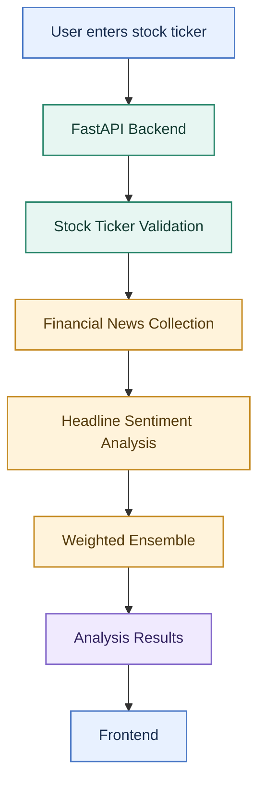

<div align="center">

# 📈 Sentock

### Financial News Sentiment Analysis & Stock Portfolio Management

**A research project and web application for analyzing financial headlines and their sentiment signals.**


</div>

Sentock is a financial news sentiment analysis project that combines natural language processing, machine learning, and a web application to analyze the sentiment of financial headlines associated with selected stocks.

The project consists of a research notebook and a web application with a FastAPI backend and a browser-based frontend.

---

## 🧭 Overview

Financial news provides information that can influence how market participants perceive a company. Sentock explores the use of sentiment analysis to process financial headlines and derive sentiment signals for stocks.

The application collects financial news headlines, processes them through multiple sentiment analysis models, and combines their outputs using a weighted ensemble.

The repository also contains the original research notebook, custom model training code, and saved model artifacts.

## ✨ Features

- **Financial news collection:** Retrieves financial headlines using Google News RSS and Finviz.
- **Multi-model sentiment analysis:** Uses FinBERT, ReyZer, VADER, and TextBlob.
- **Weighted ensemble:** Combines model sentiment scores into a single ensemble signal.
- **Custom sentiment classifier:** Includes a TF-IDF and Logistic Regression model trained on Financial PhraseBank.
- **Web application:** Provides a frontend for submitting stock tickers and viewing analysis results.
- **Research notebook:** Preserves the original stock sentiment and portfolio management experiments.

---

## 🧰 Technology Stack

| Component | Technologies |
|---|---|
| Programming languages | Python, JavaScript, HTML, CSS |
| Backend | FastAPI, Uvicorn |
| Machine learning | scikit-learn, Joblib, NumPy |
| Transformer model | FinBERT, Hugging Face Transformers |
| Sentiment analysis | VADER, TextBlob |
| News collection | Requests, BeautifulSoup, Google News RSS |
| Frontend | HTML, CSS, JavaScript |
| Research | Jupyter Notebook |

---

## 🏗️ System Architecture

The web application follows a simple request-and-response architecture.


```mermaid
flowchart TD
    A[User enters stock ticker]
    B[FastAPI Backend]
    C[Stock Ticker Validation]
    D[Financial News Collection]
    E[Headline Sentiment Analysis]
    F[Weighted Ensemble]
    G[Analysis Results]
    H[Frontend]

    A --> B
    B --> C
    C --> D
    D --> E
    E --> F
    F --> G
    G --> H

    classDef user fill:#E8F1FF,stroke:#4776C5,color:#172B4D,stroke-width:1.5px;
    classDef backend fill:#E7F6F2,stroke:#27856A,color:#123B31,stroke-width:1.5px;
    classDef processing fill:#FFF3DB,stroke:#C58A22,color:#553A0B,stroke-width:1.5px;
    classDef output fill:#F0EAFE,stroke:#8064C8,color:#30205E,stroke-width:1.5px;

    class A,H user;
    class B,C backend;
    class D,E,F processing;
    class G output;
```

### Application flow

1. The user submits a stock ticker through the frontend.
2. The backend validates the ticker.
3. Financial headlines are collected from the configured news sources.
4. The headlines are analyzed using the available sentiment models.
5. The model outputs are combined into an ensemble sentiment score.
6. The analysis results are returned to the frontend.

---

## 🧠 Sentiment Analysis Models

Sentock uses four sentiment analysis models. Each model approaches financial text differently.

| Model | Method | Description |
|---|---|---|
| FinBERT | Transformer-based classification | Analyzes financial text using contextual language representations. |
| ReyZer | TF-IDF and Logistic Regression | Custom binary financial sentiment classifier. |
| VADER | Lexicon and rule-based analysis | Estimates sentiment polarity from lexical features and rules. |
| TextBlob | Lexicon-based analysis | Provides polarity and subjectivity analysis. |

### 1. FinBERT

The application uses the pretrained `ProsusAI/finbert` model for financial sentiment classification.

FinBERT is designed for financial text and is used to analyze the sentiment of financial headlines.

The implementation supports CPU and CUDA inference, depending on the configured device and available hardware.

Model: [ProsusAI/finbert](https://huggingface.co/ProsusAI/finbert)

### 2. ReyZer — Custom Financial Sentiment Classifier

ReyZer is a custom binary sentiment classifier developed using classical machine learning.

The model uses TF-IDF feature extraction and Logistic Regression to classify financial headlines as positive or negative.

The trained classifier and its vectorizer are saved using Joblib and loaded by the backend for inference.

#### Dataset

The training workflow uses the Financial PhraseBank dataset.

Dataset: [Financial PhraseBank — Hugging Face](https://huggingface.co/datasets/gtfintechlab/financial_phrasebank_sentences_allagree)

The all-agree configuration contains financial sentences for which the annotators agreed on the sentiment label.

#### Sentiment Score

For a headline `x`, ReyZer calculates a directional sentiment score from its predicted class probabilities:

> **Sentiment Score**
>
> `S_ReyZer(x) = P(positive | x) − P(negative | x)`

The score ranges from **−1 to +1**.

- **Positive score:** The positive class probability is higher.
- **Negative score:** The negative class probability is higher.
- **Score close to 0:** The positive and negative probabilities are close.

The current model is binary and does not independently predict a neutral class.

### 3. VADER

VADER is a lexicon- and rule-based sentiment analysis model.

It provides a sentiment score based on the lexical characteristics and intensity of the input text.

### 4. TextBlob

TextBlob provides polarity and subjectivity analysis using a lexicon-based approach.

Its output is incorporated into the sentiment analysis pipeline.

---

## ⚖️ Weighted Ensemble

The application combines the sentiment outputs using the following configured weights:

| Model | Weight |
|---|---:|
| FinBERT | 40% |
| ReyZer | 30% |
| VADER | 15% |
| TextBlob | 15% |
| **Total** | **100%** |

The ensemble score is calculated as:

$$
\begin{aligned}
S_{\text{ensemble}} ={}&
0.40S_{\text{FinBERT}} \\
&+ 0.30S_{\text{ReyZer}} \\
&+ 0.15S_{\text{VADER}} \\
&+ 0.15S_{\text{TextBlob}}
\end{aligned}
$$

Here, each \(S\) represents the corresponding model's sentiment score as used by the backend.

> **Current configuration:** The ensemble combines the four model outputs into a single sentiment signal. The weights above reflect the current application configuration.

---

## 📂 Repository Structure

```text
Stock-Portfolio-Management/
│
├── backend/
│   ├── app/
│   │   ├── main.py
│   │   ├── news.py
│   │   ├── news_collector.py
│   │   └── models/
│   │       ├── finbert.py
│   │       ├── reyzer.py
│   │       ├── vader.py
│   │       └── textblob_model.py
│   │
│   ├── saved_models/
│   │   ├── reyzer_model.joblib
│   │   ├── reyzer_vectorizer.joblib
│   │   ├── reyzer_balanced_model.joblib
│   │   └── reyzer_balanced_vectorizer.joblib
│   │
│   ├── training/
│   │   └── train_reyzer.py
│   │
│   └── requirements.txt
│
├── frontend/
│   ├── index.html
│   ├── analyze.html
│   ├── css/
│   │   └── styles.css
│   └── js/
│       ├── main.js
│       └── analyze.js
│
├── research/
│   └── Sentiment_Analysis_Stock_Portfolio_Management.ipynb
│
├── .gitignore
└── README.md
```

The `backend/` directory contains the API, news collection modules, sentiment models, and saved model artifacts.

The `frontend/` directory contains the web interface and its associated styling and JavaScript.

The `research/` directory contains the original Jupyter notebook used for the stock sentiment and portfolio management research.

---

## 🚀 Getting Started

Follow these steps to run the application locally.

### Prerequisites

- Python installed on your system.
- Git.
- A modern web browser.

For GPU inference, a compatible NVIDIA GPU and CUDA-enabled PyTorch installation are required. CPU inference is also supported.

### 1. Clone the repository

```bash
git clone https://github.com/creydit/Stock-Portfolio-Management.git

cd Stock-Portfolio-Management
```

### 2. Create a virtual environment

On Windows:

```bash
python -m venv .venv

.venv\Scripts\activate
```

On Linux or macOS:

```bash
python3 -m venv .venv

source .venv/bin/activate
```

### 3. Install dependencies

```bash
pip install -r backend/requirements.txt
```

Ensure that the installed PyTorch version is compatible with your hardware and Python environment.

### 4. Start the backend

From the repository root, run:

```bash
uvicorn app.main:app --app-dir backend --reload
```

The application should be accessible at:

http://127.0.0.1:8000

FastAPI interactive API documentation is available at:

http://127.0.0.1:8000/docs

The backend is configured to serve the frontend and handle analysis requests.

---

## 📓 Research: Stock Sentiment & Portfolio Management

The `research/` directory contains the original Jupyter notebook:

`Sentiment_Analysis_Stock_Portfolio_Management.ipynb`

This notebook preserves the research and experimentation associated with financial sentiment analysis and stock portfolio management.

The research explores the relationship between financial sentiment signals and portfolio allocation concepts.

Research experiments and results should be interpreted in the context of the notebook's actual implementation and assumptions. They are separate from the current web application's functionality unless explicitly integrated into the backend.

---

## 🔭 Future Work

Potential areas for further development include:

- Improving news collection and headline deduplication.
- Evaluating sentiment models on additional financial datasets.
- Integrating historical market data into portfolio analysis.
- Extending the research with systematic backtesting and transaction costs.
- Deploying the web application.

These are potential extensions and are not claims about functionality currently implemented.

---

## 👤 Author

**Shreyansh**  
B.Tech, Computer Science and Engineering  
National Institute of Technology, Raipur

GitHub: [@creydit](https://github.com/creydit)

---

## ⚠️ Disclaimer

Sentock is an educational and research-oriented project for financial sentiment analysis and stock portfolio management.

The sentiment outputs are experimental and should not be interpreted as guarantees of market performance or investment returns.

This project does not provide personalized financial advice or recommendations to buy or sell securities.
